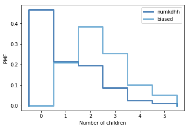

[Think Stats Chapter 3 Exercise 1](http://greenteapress.com/thinkstats2/html/thinkstats2004.html#toc31) (actual vs. biased)

```python
import nsfg
import thinkstats2
import thinkplot
```

```python
df=nsfg.ReadFemResp()
```

```python
pmf = thinkstats2.Pmf(df.numkdhh, label='numkdhh')
```

```python
def BiasPmf(pmf, label):
    new_pmf = pmf.Copy(label=label)

    for x, p in pmf.Items():
        new_pmf.Mult(x, x)
        
    new_pmf.Normalize()
    return new_pmf
```

```python
biased=BiasPmf(pmf,'biased')
```

```python
thinkplot.PrePlot(2)
thinkplot.Pmfs([pmf, biased])
thinkplot.Config(xlabel='Number of children', ylabel='PMF')
```

