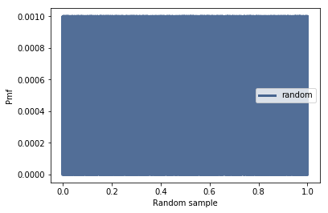
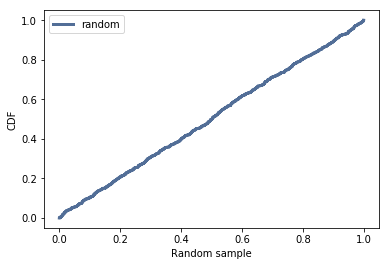

[Think Stats Chapter 4 Exercise 2](http://greenteapress.com/thinkstats2/html/thinkstats2005.html#toc41) (a random distribution)


```python
import numpy
import thinkstats2
import thinkplot
```

```python
random=numpy.random.random_sample((1000,))
```

```python
pmf = thinkstats2.Pmf(random, label='random')
```

```python
thinkplot.Pmf(pmf)
thinkplot.Config(xlabel='Random sample', ylabel='Pmf')
```




```python
cdf = thinkstats2.Cdf(random, label='random')
thinkplot.Cdf(cdf)
thinkplot.Config(xlabel='Random sample', ylabel='CDF', loc='upper left')
```



The CDF is approximately a straight line and the PMF shows that the sample is unifromly distributed between 0 and 1.